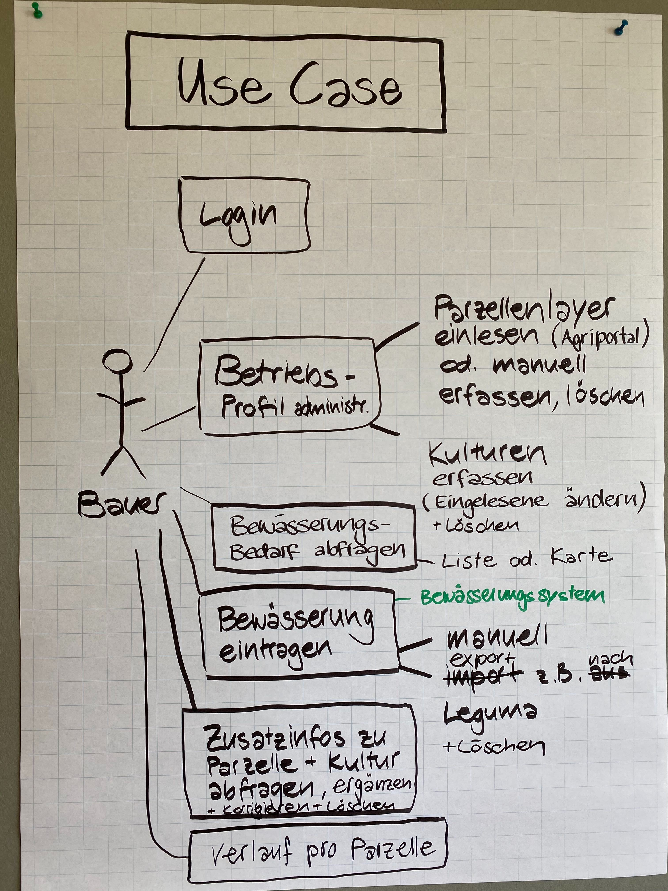

### Open Farming Hackdays Challenge 07

## DropAdvisor - Smarte Bewässerung – Eine Entscheidungshilfe

### Start with a Plan - Big Data Management Canvas
Der Big Data Management Canvas ist der perfekte Ausgangspunkt für ein Daten Projekt. Hierbei schaut man das Projekt aus der Business sowie aus der technischen Sicht an. 

### Umsetzbare Teilaufgaben
Während den Hackdays haben wir uns auf folgende "Felder" des BDM Canvas konzentriert:

- Analytics
- Datafication
- Interaction

### Analytics
Was: Können wir aus den bestehenden Daten (Sonden / Saugspanne und Wetterdaten) ein Modell erstellen, welches die Saugspanne vorraussagt?

Wie: Explatory Data Analysis. Gibt es zwischen den verfügbaren Parametern einen Zusammenhang zur Zielvariable? Hierbei wird eine Station mit Bodensonde mit den passenden Wetterdaten zu einem Datenset zusammengefügt. Die Hypothese ist: Wenn es viel regnet, dann ist der Boden nass :-) Mit Rolling Windows werden jeweils die letzten 5 Tage an Regenfällen zusammen summiert. 

Resultat: Nein :-) Rein auf Wetterdaten basierend kann kein zuverlässiges Modell erstellt werden. Was ist das Problem? Wir haben keine "naturbelassenen" Daten. Wenn ein Feld trocken wird, dann wird es bewässert. Hierbei müssten Messdaten in diversen Bodenbeschaffenheiten gesammelt werden, welche über längere Zeit "in Ruhe" gelassen werden. 

Update 30min nachdem der Text oben geschrieben wurde:
Y = x1 + x1*x2
x1 = Regenfall in mm in den letzten 25 Tagen
x2 = Temperatur der letzten 7 Tage

### Datafication
Was: Welche Daten benötigen wir und wie kommen wir genau an diese Daten?
Hier wurden vorallem die Möglichkeiten des MeteoTest Datensets für die Analyse angeschaut. Hierbei haben wir auf [bodenmessnetz.ch](https://bodenmessnetz.ch/messwerte/datenabfrage) die Messwerte der Sonde im Liebegg heruntergeladen und diese mit den Wetterdaten verknüpft.

Des weiteren haben wir versucht an Satelitendaten zu kommen um mit denen die Beschaffenheit des Bodens zu Berechnen. Elon Musk hatte aber gerade seinen Tesla in der Werkstatt und konnte uns die Daten nicht rechtzeitig schicken. Kommt noch, gäll Elon?

Update: Elon hat geliefert. Jedoch reicht die Zeit nicht aus um uns mit den GIS Daten auseinander zu setzen. Dafür gibt es an dieser Stelle ein Screenshot der Daten:

Auf dem Bild sieht man auf 1km * 1km genau welche Feuchtigkeit der Boden aufweist. 

### Interaction
Gute Modelle und Daten bringen rein gar nix, wenn der Benutzer nicht damit interagieren kann. Deshalb hat sich unser UX Team direkt an ein Mockup gesetzt um die Bedürfnisse der Landwirte abzudecken. Angefangen hat es mit einem Use Case Diagram:

Dann haben wir uns ans Mockupen gewagt. Der fertige und Klickbare Mockup findet man hier:
[Balsamiq Cloud](https://balsamiq.cloud/swkxz9c/pbt93op/r1892?f=N4IgUiBcCMA0IDkpxAYWfAMhkAhHAsjgFo4DSUA2gLoC%2BQA%3D]())

